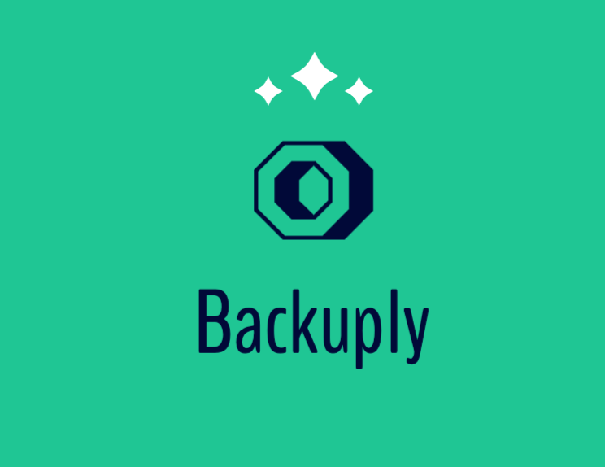

<p align="center">
  <a href="" rel="noopener">
 </a>
</p>

<h3 align="center">Backuply</h3>

<div align="center">

[](https://sykesdev.ca/projects/)
[](https://sykesdev.ca/projects/)
[](https://github.com/SystemFiles/backuply/actions/workflows/ci.yml)
[](https://github.com/SystemFiles/backuply/actions/workflows/cd.yml)
[](https://github.com/SystemFiles/backuply/issues)
[](https://github.com/SystemFiles/backuply/issues)
[](/LICENSE)

</div>

---

<p align="center"> A Simple backup client with an emphasis on ease-of-use
    <br> 
</p>

## 🧐 About <a name = "about"></a>

Simple backup client written in NodeJS with an emphasis on ease-of-use and speed. Has the ability to create both full backups and then differential backups to save space and time.

## 💾 Installation

Install Backuply using NPM

```bash
# Install the latest version
npm i -g backuply

# Install a specific version
npm i -g backuply@<tag>
```

## 👷‍♂️ Usage

Using Backuply is simple by design. Simply start with the operation (backup, restore, or config) and optionally specify any additional options to apply. Backuply will work without any initial configuration making it easy to pick up and use right away...

```
Usage: backuply <command> [options...]

Commands:
  app.js config   configure backuply
  app.js list     Displays a list of all backups that are currently known by the
                   system. Use --name to filter backups by name
  app.js backup   Performs a custom backup of a select directory(s)
  app.js restore  Perform a restore from a target backup

Options:
  --help     Show help                                                 [boolean]
  --version  Show version number                                       [boolean]
```

Most functionality such as backup type is automatically determined based on how you are creating the backup. Backup options shown below.

```
Usage: backuply backup [options...]

Descrtiption: Performs a custom backup of a select directory(s)

Positionals:
  name    The name for this backup                                      [string]
  source  The source directory to use for the backup. This is the directory that
           will be at the root of your backup                           [string]
  dest    The destination path which will contain the backup.           [string]

Options:
  --help     Show help                                                 [boolean]
  --version  Show version number                                       [boolean]
  --ref      A reference id or name for the full backup used in generating a dif
             ferential backup based on the reference.                   [string]

Examples:
  # Will create a full backup of the source directory
  - backuply backup <name> <source_path> <destination_path>
  # Will create a differential backup when recognizing referenced full backup
  - backuply backup <name> <source_path> <destination_path> --ref <name/uuid>
```

> By using a backup name for the reference parameter will provide **only** the latest full backup that matches the specified name ... If you intend on creating a differential backup with a full backup base other than the most recent full backup for backups matching a certain name, you will likely have to list and select the backup using a reference ID for the target backup. [Tracking Issue](https://github.com/SystemFiles/backuply/issues/38)

Restoring from an existing backup could not be easier.

```
Usage: backuply restore [options...]

Description: Perform a restore from a target backup

Positionals:
  ref   The full uuid or name for the backup to restore                 [string]
  dest  Path to destination restore directory                           [string]

Options:
  --help     Show help                                                 [boolean]
  --version  Show version number                                       [boolean]
  --full     If using a name reference, tells backuply whether to restore only t
             he latest full backup (if exists with ref)                [boolean]
```

Listing backups can be a useful way to discover important information related to the backups you have created in the past. It can also be a good way to get reference ID's for old backups that you may want to restore or use as a base for a new backup.

```
Usage: backuply list [search term]

Description: Displays a list of all backups that are currently known by the system. 
             Use --name to filter backups by name

Options:
  --help     Show help                                                 [boolean]
  --version  Show version number                                       [boolean]
  --name     An optional variable used to filter backups by their 
             user-given names                                           [string]
```

### ⚙️ App Configuration

Making changes to any app configuration can be done in a single one-line command which is capable of modifying multiple attributes at a time. See below for usage details and some examples

```
Usage: backuply config [keys...] [values...]

Description: Configures backuply

Options:
  --help       Show help                                               [boolean]
  --version    Show version number                                     [boolean]
  --db.path    Configure the path to the local database used to store 
               backup metadata                                          [string]
  --log.level  Configure the logging level                              [string]

Examples:
  # Enable debug logging (default is INFO)
  - backuply config --log.level DEBUG
  # Change local db path (default depends on platform ... for example on linux: /home/<you>/.config/backuply/db.json)
  - backuply config --db.path ~/Documents/backuply/db.json
```

Future iterations with more config options will follow the same format and will also be documented in the `config --help` subcommand.

## 🧩 Contributing

If you would like to contribute an idea, feature request, or bugfix please start by creating an [issue](https://github.com/SystemFiles/backuply/issues). I would greatly appreciate any constructive criticism and help from the community!

## 👷‍♂️ Authors <a name = "authors" >

- [Ben Sykes (SystemFiles)](https://sykesdev.ca/)